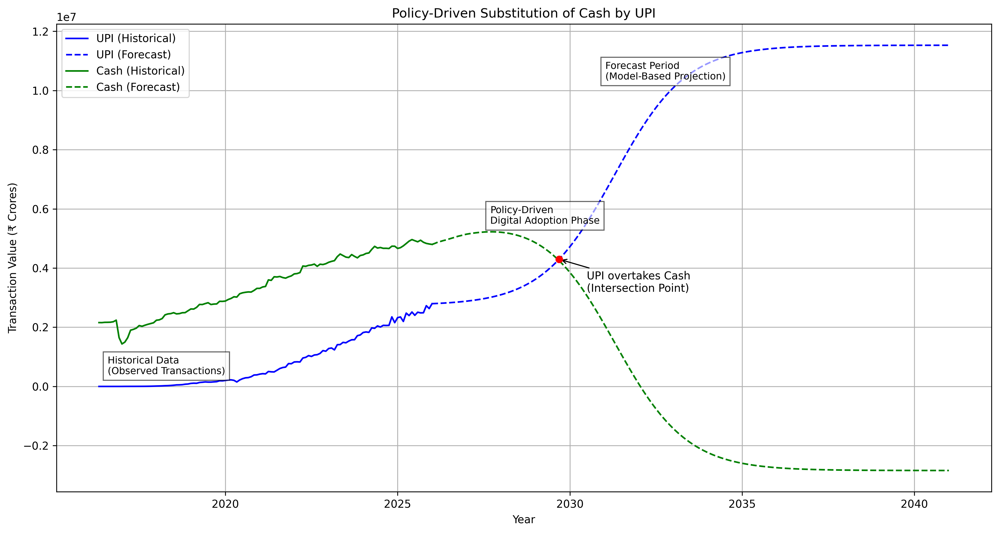
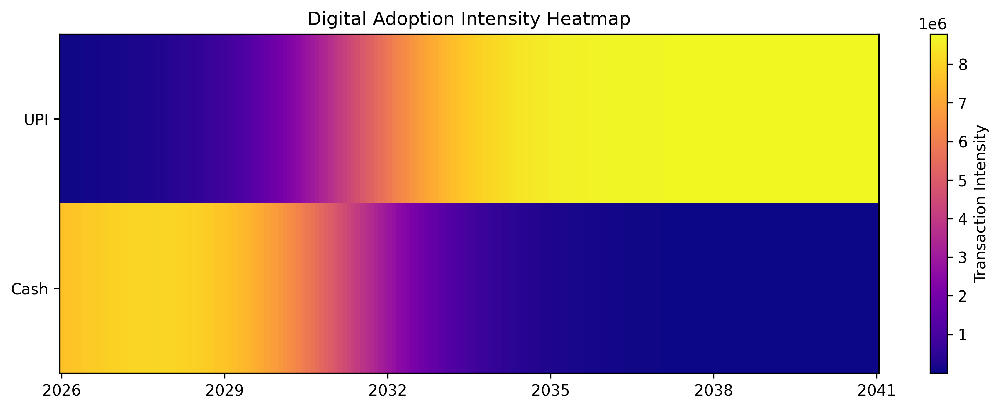

# PayVision AI

## Digital Payment Intelligence Platform

## 📌 Project Overview

PayVision AI forecasts the long-term adoption of digital payments (UPI) relative to cash circulation using machine learning and advanced analytics.

The platform integrates:

- AI forecasting
- uncertainty modeling
- anomaly detection
- fraud risk intelligence
- policy simulation
- automated reporting
- interactive visualization

This system reflects financial intelligence tools used by central banks, fintech companies, and digital economy researchers.

---

## 🎯 Objectives

- Forecast digital payment adoption trends
- Analyze substitution dynamics between cash and UPI
- Simulate policy-driven adoption scenarios
- Detect anomalies and fraud indicators
- Estimate forecast reliability & uncertainty
- Generate automated intelligence reports

---

## 🧠 System Architecture

PayVision AI follows a modular, scalable architecture:

- **Forecast Engine** → AI prediction & adoption modeling  
- **Analytics Layer** → metrics, uncertainty & anomaly detection  
- **Visualization Layer** → charts, heatmaps & interactive insights  
- **Reporting Module** → automated PDF & CSV exports  
- **Monitoring System** → anomaly alerts & health checks  
- **CLI Interface** → professional command-based interaction  

This architecture ensures scalability, maintainability, and production readiness.


---

## 🗂 Project Structure

```
digital_payment_forecast/
│
├── analytics/
│   ├── __init__.py
│   ├── metrics.py
│   ├── export.py
│   ├── policy.py
│   ├── report.py
│   ├── anomaly.py
│   ├── uncertainty.py
│   ├── visualization.py
│   └── interactive_chart.py
│
├── cli/
│   ├── __init__.py
│   ├── forecast.py
│   ├── crossover.py
│   ├── simulate.py
│   ├── report.py
│   └── menu.py
│
├── data/
│   ├── final_upi_data_2016_2025.csv
│   └── cash_data.csv
│
├── models/
│   ├── __init__.py
│   ├── adoption_model.py
│   ├── lstm_total.py
│   └── train_total_lstm.py
│
├── utils/
│   ├── __init__.py
│   ├── plotting.py
│   └── preprocessing.py
│
├── outputs/
│   ├── forecast.png
│   ├── heatmap.png
│   ├── interactive_forecast.html
│   ├── forecast.csv
│   └── report.pdf
│
├── main.py
├── cli.py
└── README.md
```
---

## 🤖 Technology Stack

### Core Development

• Python

### Machine Learning

• TensorFlow / Keras (LSTM Forecasting)

### Data Processing

• NumPy & Pandas

### Visualization

- Matplotlib (forecast & heatmap)
- Plotly (interactive charts)

### Reporting & CLI

- ReportLab (PDF reports)
- Typer & Rich (CLI interface)

---

## 🔮 AI Forecasting Engine

- LSTM time-series forecasting
- Policy-driven adoption modeling
- Cash vs digital substitution analysis
- 15-year projection horizon

---

## 📉 Uncertainty & Risk Analysis

- Forecast confidence bands
- Statistical anomaly detection
- Anomaly markers on charts
- Real-time system health alerts

These features enhance reliability and risk awareness.

---

## 🚨 Fraud & Risk Intelligence

The system detects abnormal transaction patterns and provides interpretative insights.

Possible anomaly causes:

- sudden digital adoption spikes
- regulatory or policy changes
- seasonal economic shifts
- potential misuse or fraud activity

---

## 📊 Visual Intelligence Outputs

### 📈 Forecast Visualization

**Shows historical trends, future projections, confidence bands, and anomaly indicators.**

### 🔥 Adoption Intensity Heatmap

**Highlights the intensity and evolution of digital payment adoption.**

### 🌐 Interactive Digital Payment Forecast

Explore the live interactive dashboard with zoom and hover insights:

**🔗 https://rgtrigger.github.io/payvision-ai/outputs/interactive_forecast.html**


---

## 📈 Advanced Analytics & Insights

PayVision AI provides:

- Projected UPI share in 2035
- Projected cash share in 2035
- Adoption speed index
- Long-term growth insights
- Policy impact comparisons

---

## 🧪 Policy Simulation

- Simulate how policy strength influences adoption speed.

- Example:

python cli.py simulate --policy 0.12

---

## 📄 Automated Reporting

Executive-ready reports include:

- forecast metrics
- fraud & risk insights
- adoption intelligence

Generated outputs:

- outputs/report.pdf
- outputs/forecast.csv
- outputs/forecast.png

---

## 🖥 Monitoring & Alerts

Real-time monitoring features:

- anomaly alerts
- system health check
- interactive CLI menu

Launch monitoring:

python cli.py menu

---

## ⚙️ How to Run the Project

### 1️⃣ Install dependencies

pip install -r requirements.txt

### 2️⃣ Run forecast & visualization

python cli.py forecast

### 3️⃣ Generate intelligence report

python cli.py report

### 4️⃣ Launch monitoring menu

python cli.py menu

---

## 📁 Output Files
```
outputs/
• forecast.png
• heatmap.png
• interactive_forecast.html
• forecast.csv
• report.pdf
```
---

## 🏦 Real-World Applications

- fintech adoption analysis
- digital economy research
- central bank policy evaluation
- payment infrastructure planning
- fraud & anomaly monitoring

---

## 🚀 Key Highlights

- AI-powered forecasting
- uncertainty & anomaly detection
- fraud insight reporting
- interactive visualization
- policy simulation engine
- automated reporting & exports
- real-time monitoring & alerts

---

## 📌 Repository

GitHub Repository: RGTrigger

---

## 👨‍💻 Author

Gaurav,
B.Tech – Computer Science & Communication Engineering
KIIT Deemed to be University

---

Thank you for reviewing PayVision AI.
